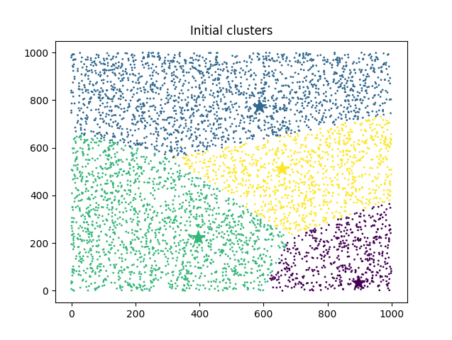
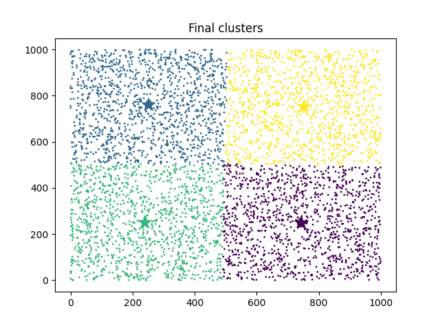
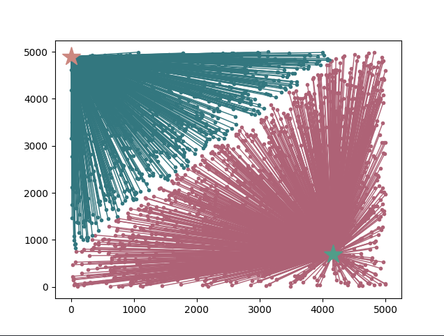
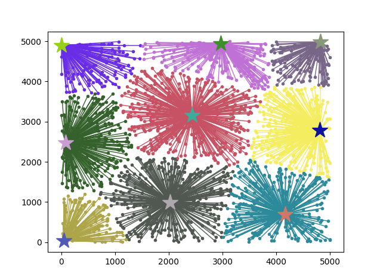
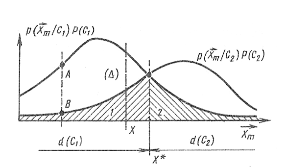
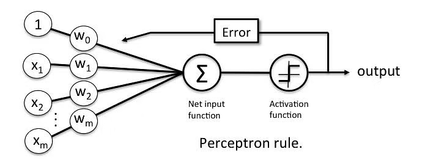
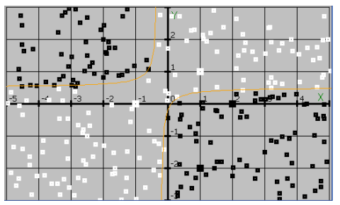
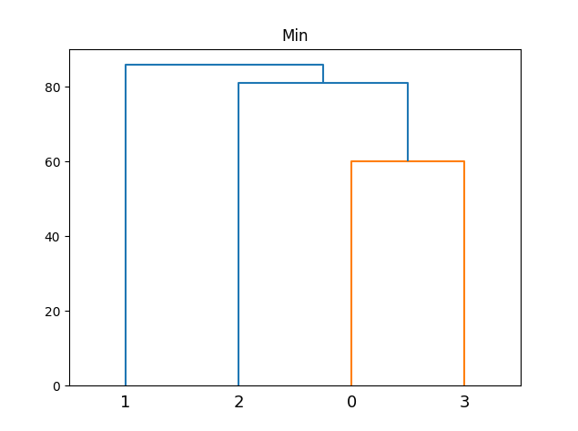
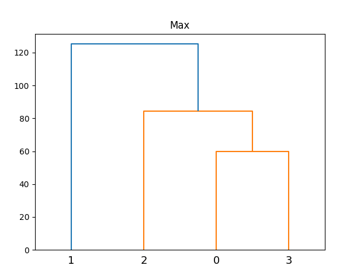

# MethodsOfTakingDecisions
<h3>1 practice task</h3>

K-means clustering algorithm realization

<h3>2 practice task</h3>

Maximin clustering algorithm realization

<h3>3 practice task</h3>

Clustering with probability density function

<h3>4 practice task</h3>

Perceptron algorithm

<h3>5 practice task</h3>

Clustering with potential method

<h3>6 practice task</h3>

Method of hierarchical grouping of images

